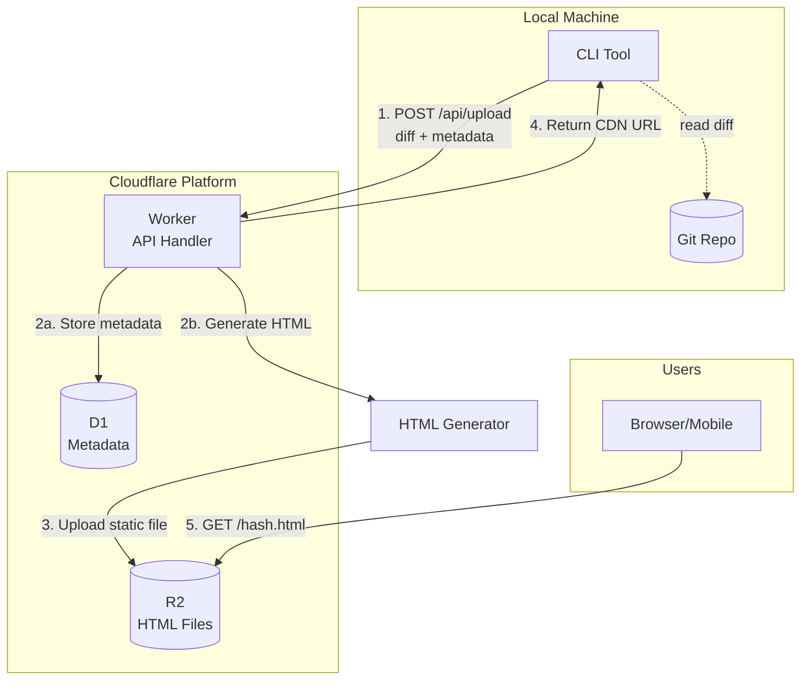

# Diff Share

A lightweight service for sharing local git diffs via temporary online links.

## Problem

When working on local git repositories with uncommitted changes, it's difficult to:
- View diffs on mobile devices when away from the computer
- Share work-in-progress changes with teammates quickly
- Review code changes without pushing to remote
- Share specific commit changes or compare between versions

## Solution

Diff Share provides a simple way to:
1. Upload local git diffs to a temporary online storage
2. Generate shareable links that expire after a set time
3. View diffs beautifully formatted in the browser

## Architecture



### Data Flow

1. **CLI Upload**: User runs `diff-share` command with various options
2. **Worker Process**: Cloudflare Worker receives diff, generates HTML page
3. **Storage**: Metadata saved to D1, HTML file uploaded to R2 bucket
4. **Access**: User receives CDN link to view the diff

## Features

- **Multiple Diff Sources**:
  - Current uncommitted changes
  - Specific commit (`--commit`)
  - Range between commits (`--from/--to` or `commitA..commitB`)
  - Branch comparison (`--base`)
  - Staged changes only (`--staged`)

- **Flexible Expiration**: Configure TTL per upload (1h, 24h, 7d, 30d)
- **Auto Cleanup**: Expired files automatically deleted from R2
- **Mobile-friendly**: Responsive web interface
- **Private by default**: Unguessable hash-based URLs
- **No GitHub required**: Works with any local git repo

## Usage

> **Note**: Make sure you've built the CLI first (`bun run build` in `packages/cli`).

### CLI Commands

Assuming your CLI is at `./packages/cli/dist/cli.js`:

```bash
# Current uncommitted changes (working directory)
./packages/cli/dist/cli.js

# Specific commit
./packages/cli/dist/cli.js --commit abc123
./packages/cli/dist/cli.js -c HEAD~3

# Compare two commits
./packages/cli/dist/cli.js --from abc123 --to def456
./packages/cli/dist/cli.js abc123..def456

# Compare current branch with base branch
./packages/cli/dist/cli.js --base main

# Staged changes only
./packages/cli/dist/cli.js --staged

# With custom options
./packages/cli/dist/cli.js --commit HEAD~5 --ttl 7d --title "Revert changes" --open
```

Or set an alias for convenience:
```bash
alias diff-share='./packages/cli/dist/cli.js'

# Now you can use it directly
diff-share --commit abc123
```

### CLI Options

| Option | Short | Description | Default |
|--------|-------|-------------|---------|
| `--commit` | `-c` | Show specific commit | - |
| `--from` | - | Range start commit | - |
| `--to` | - | Range end commit | `HEAD` |
| `--base` | - | Compare with base branch | - |
| `--staged` | - | Staged changes only | false |
| `--title` | `-t` | Custom page title | Auto-generated |
| `--description` | `-d` | Additional description | - |
| `--ttl` | - | Expiration in hours | 24 |
| `--open` | `-o` | Auto-open in browser | false |
| `--copy` | - | Copy link to clipboard | false |

### Web Interface

Open the shared link in any browser:
```
https://r2.diff-share.com/a3f7b2c8d9e1f5a2.html
```

## Tech Stack

| Component | Technology |
|-----------|------------|
| **API Backend** | Cloudflare Workers (Hono) |
| **Storage** | Cloudflare R2 (HTML files) |
| **Metadata** | Cloudflare D1 (SQLite) |
| **CDN** | Cloudflare CDN (global edge) |
| **CLI** | Bun + Commander.js |
| **HTML Gen** | Syntax highlighting + templates |

## Project Structure

```
diff-share/
├── packages/
│   ├── cli/           # CLI tool
│   │   ├── src/
│   │   │   ├── index.ts
│   │   │   ├── git.ts
│   │   │   └── upload.ts
│   │   └── package.json
│   └── worker/        # Cloudflare Worker
│       ├── src/
│       │   ├── index.ts
│       │   ├── routes.ts
│       │   ├── html-generator.ts
│       │   └── cleanup.ts
│       └── wrangler.toml
├── shared/            # Shared types and utils
└── README.md
```

## Quick Start

### 1. Clone & Deploy

```bash
git clone git@github.com:KrabsWong/diff-share.git
cd diff-share
```

#### First Time Deployment (Full Setup)

```bash
# Create D1, R2, init database, deploy Worker, build CLI
./deploy.sh --full
```

#### Quick Update (Code Changes Only)

```bash
# Just redeploy Worker and rebuild CLI
./deploy.sh

# Or only update Worker (fastest)
./deploy.sh --worker-only
```

**Deploy Script Options:**
- `./deploy.sh` - Quick update (Worker + CLI) **← Use this for updates**
- `./deploy.sh --full` - First time setup (D1 + R2 + schema + deploy)
- `./deploy.sh --init` - Initialize infrastructure only (no deploy)
- `./deploy.sh --worker-only` - Deploy only Worker
- `./deploy.sh --help` - Show all options

After deployment, you'll get your Worker URL (e.g., `https://diff-share-worker.xxx.workers.dev`).

### 2. Use CLI

```bash
# Set your API URL (replace with your actual Worker URL)
export DIFF_SHARE_API_URL=https://diff-share-worker.xxx.workers.dev

# Now you can use the CLI
cd packages/cli
./dist/cli.js --help

# Examples
./dist/cli.js                              # Share working directory changes
./dist/cli.js --commit abc123              # Share specific commit
./dist/cli.js abc123..def456               # Share range between commits
./dist/cli.js --base main                  # Compare with main branch
```

**Tip**: Add to your shell profile for convenience:
```bash
echo 'export DIFF_SHARE_API_URL=https://diff-share-worker.xxx.workers.dev' >> ~/.zshrc
```

---

## Development

### Prerequisites

- [Bun](https://bun.sh/) installed
- Cloudflare account

### Local Development

```bash
# Start Worker locally
cd packages/worker
bun run dev

# Build and test CLI
cd packages/cli
bun run build
./dist/cli.js --api-url http://localhost:8787
```

### Manual Deployment (if deploy.sh doesn't work)

See [DEPLOY.md](DEPLOY.md) for detailed manual deployment instructions.

## Expiration & Cleanup

### Strategy

1. **Per-file expiration**: Each upload has exact expiration timestamp stored in D1
2. **Cron cleanup**: Worker runs every 6 hours to delete expired files
3. **R2 lifecycle**: 30-day fallback rule to prevent unlimited growth

```javascript
// Worker scheduled task
export default {
  async scheduled(controller, env, ctx) {
    // Query expired records from D1
    const expired = await env.DB.prepare(`
      SELECT hash FROM diffs WHERE expire_at < datetime('now')
    `).all();
    
    // Batch delete from R2
    for (const { hash } of expired.results) {
      await env.DIFF_BUCKET.delete(`${hash}.html`);
    }
    
    // Clean up D1 records
    await env.DB.prepare(`
      DELETE FROM diffs WHERE expire_at < datetime('now')
    `).run();
  }
};
```

## HTML Regeneration (After Deployment Updates)

After deploying new Worker code (especially when updating the HTML template), you may want to regenerate existing diff pages to apply the new styles/features:

### Regenerate Single Diff

```bash
curl -X POST https://your-worker.workers.dev/api/regenerate \
  -H "Content-Type: application/json" \
  -d '{"hash": "a3f7b2c8d9e1f5a2"}'
```

### Regenerate All Unexpired Diffs

```bash
curl -X POST https://your-worker.workers.dev/api/regenerate \
  -H "Content-Type: application/json" \
  -d '{"all": true}'
```

### With Authentication (Optional)

To protect the endpoint, set `REGENERATE_TOKEN` in your `wrangler.toml`:

```toml
[vars]
REGENERATE_TOKEN = "your-secret-token"
```

Then include it in requests:

```bash
curl -X POST https://your-worker.workers.dev/api/regenerate \
  -H "Content-Type: application/json" \
  -H "Authorization: Bearer your-secret-token" \
  -d '{"all": true}'
```

**Note**: This works because we store the original diff content in D1, allowing us to re-render with updated templates anytime.

## License

MIT

## Author

KrabsWong
